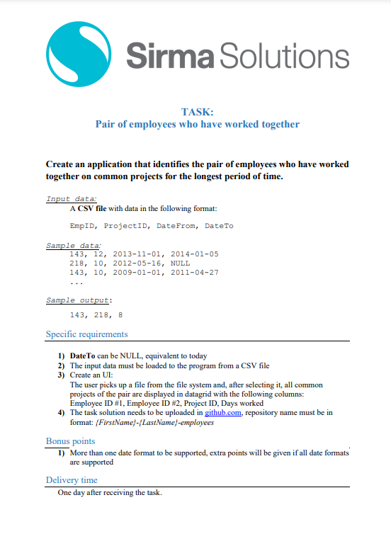

# Stoyko-Tarkalanov-employees

## This app is designed to identify the pair of employees who have worked together on common projects for the longest period of time.

## Test file can be found in the repository. These files cover 3 different cases:

- When we have pair;
- When we do not have pair;
- When we have different time formats;

---

## Task Description:

